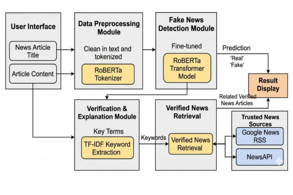

# VeriNews

VeriNews is a Streamlit-based fake news detection app powered by a fine-tuned RoBERTa model.  
It predicts whether a news article is real or fake and helps with verification by surfacing live reference content from the web.

## Model

- Base model: `RoBERTa-base` from Hugging Face Transformers
- Fine-tuned on:
	- LIAR
	- ISOT
	- WELFake

## Features

- Clean web interface built with Streamlit
- RoBERTa-based real/fake classification
- Support for multiple fake-news datasets
- Live reference content retrieval for verification



## Quick Start

### 1. Clone and enter the project

```bash
git clone https://github.com/yuvrajpinkman/VeriNews.git
cd VeriNews
```

### 2. Create and activate a virtual environment (recommended)

```bash
# Python 3.10+ is required
python -m venv roberta-env

# Windows PowerShell
roberta-env\Scripts\Activate.ps1
```

### 3. Install dependencies

```bash
pip install -r requirements.txt
```

### 4. Set up Hugging Face credentials

The app automatically loads the fine-tuned model from Hugging Face. Add your Hugging Face token to `.streamlit/secrets.toml`:

```toml
HF_TOKEN = "your_huggingface_token_here"
```

Get your token from https://huggingface.co/settings/tokens

You can also provide `HF_TOKEN`, `GROQ_API_KEY`, and `NEWS_API_KEY` as environment variables if you prefer not to use `secrets.toml`.

### 5. Run the app

```bash
bash run.sh
```

If you prefer to run it directly without the helper script, use:

```bash
./roberta-env/bin/python -m streamlit run app.py
```

## Deploy To Streamlit Community Cloud

1. Push this repository to GitHub.
2. Open Streamlit Community Cloud and create a new app from the repo.
3. Set the app entrypoint to `app.py`.
4. Add these secrets in the Streamlit Cloud secrets manager:

```toml
HF_TOKEN = "your_huggingface_token_here"
GROQ_API_KEY = "your_groq_api_key_here"
NEWS_API_KEY = "your_newsapi_key_here"
```

5. Deploy the app.

For local development, you can copy [.streamlit/secrets.toml.example](.streamlit/secrets.toml.example) to `.streamlit/secrets.toml` and fill in your values.

## Notes

- The fine-tuned RoBERTa model is hosted on Hugging Face: [singhyuvraj999/Roberta_FineTuned](https://huggingface.co/singhyuvraj999/Roberta_FineTuned)
- If you prefer to use a locally downloaded model instead, follow the instructions in [Model.md](Model.md).
- If PowerShell blocks activation scripts, run:

```powershell
Set-ExecutionPolicy -Scope Process -ExecutionPolicy RemoteSigned
```

## License

This project is licensed under the terms in [LICENSE](LICENSE).
